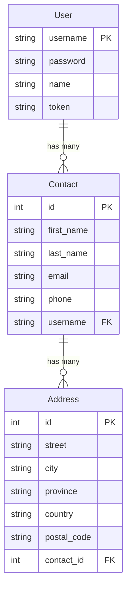

# NestJS RESTful API — Knowledge Reference

> **Sumber**: Presentasi "NestJS RESTful API" oleh Eko Kurniawan Khannedy (ProgrammerZamanNow)
> **Tujuan**: Panduan implementasi RESTful API Contact Management dengan NestJS + Prisma + Zod

---

## Table of Contents

1. [Project Overview & Requirements](#1-project-overview--requirements)
2. [Tech Stack & Dependencies](#2-tech-stack--dependencies)
3. [Database Schema (Prisma)](#3-database-schema-prisma)
4. [Project Structure & Setup](#4-project-structure--setup)
5. [Common Module (Shared Infrastructure)](#5-common-module-shared-infrastructure)
6. [User API](#6-user-api)
7. [Contact API](#7-contact-api)
8. [Address API](#8-address-api)
9. [Distribution & Deployment](#9-distribution--deployment)
10. [Patterns & Best Practices](#10-patterns--best-practices)

---

## 1. Project Overview & Requirements

### Studi Kasus: Contact Management API

RESTful API untuk manajemen kontak dengan 3 domain utama:

| Domain   | Deskripsi                           |
|----------|-------------------------------------|
| User     | Autentikasi & manajemen user        |
| Contact  | CRUD & search kontak                |
| Address  | Alamat yang terkait dengan kontak   |

---

### User Management

**Data User:**

| Field    | Keterangan              |
|----------|------------------------|
| Username | Unique identifier       |
| Password | Hashed (bcrypt)         |
| Name     | Display name            |

**User API Endpoints:**

| Endpoint               | Method | Auth  | Keterangan               |
|------------------------|--------|-------|--------------------------|
| `/api/users`           | POST   | No    | Register User             |
| `/api/users/login`     | POST   | No    | Login User                |
| `/api/users/current`   | GET    | Yes   | Get Current User          |
| `/api/users/current`   | PATCH  | Yes   | Update Current User       |
| `/api/users/current`   | DELETE | Yes   | Logout User               |

---

### Contact Management

**Data Contact:**

| Field      | Keterangan       |
|------------|-----------------|
| First Name | Nama depan       |
| Last Name  | Nama belakang    |
| Email      | Email kontak     |
| Phone      | Nomor telepon    |

**Contact API Endpoints:**

| Endpoint                | Method | Auth | Keterangan         |
|------------------------|--------|------|--------------------|
| `/api/contacts`        | POST   | Yes  | Create Contact      |
| `/api/contacts/:id`    | GET    | Yes  | Get Contact         |
| `/api/contacts/:id`    | PUT    | Yes  | Update Contact      |
| `/api/contacts/:id`    | DELETE | Yes  | Remove Contact      |
| `/api/contacts`        | GET    | Yes  | Search Contact      |

---

### Address Management

**Data Address:**

| Field       | Keterangan       |
|-------------|-----------------|
| Street      | Jalan            |
| City        | Kota             |
| Province    | Provinsi         |
| Country     | Negara           |
| Postal Code | Kode pos         |

**Address API Endpoints:**

| Endpoint                                      | Method | Auth | Keterangan     |
|-----------------------------------------------|--------|------|----------------|
| `/api/contacts/:contactId/addresses`          | POST   | Yes  | Create Address  |
| `/api/contacts/:contactId/addresses/:id`      | GET    | Yes  | Get Address     |
| `/api/contacts/:contactId/addresses/:id`      | PUT    | Yes  | Update Address  |
| `/api/contacts/:contactId/addresses/:id`      | DELETE | Yes  | Remove Address  |
| `/api/contacts/:contactId/addresses`          | GET    | Yes  | List Address    |

---

## 2. Tech Stack & Dependencies

### Membuat Project

```bash
nest new belajar-nestjs-restful-api
```

### Dependencies

```bash
# Validation
npm install zod

# Database ORM
npm install --save-dev prisma

# Logging
npm install nest-winston winston

# Password Hashing
npm install bcrypt
npm install --save-dev @types/bcrypt

# UUID Generator
npm install uuid
npm install --save-dev @types/uuid

# Configuration (Environment Variables)
npm install @nestjs/config
```

### Summary Dependencies

| Package          | Fungsi                                  | Type       |
|------------------|-----------------------------------------|------------|
| `zod`            | Schema validation                       | Runtime    |
| `prisma`         | Database ORM CLI                        | Dev        |
| `@prisma/client` | Database ORM Client                     | Runtime    |
| `nest-winston`   | Winston logger integration for NestJS   | Runtime    |
| `winston`        | Logging library                          | Runtime    |
| `bcrypt`         | Password hashing                         | Runtime    |
| `uuid`           | Generate unique identifiers              | Runtime    |
| `@nestjs/config` | Environment variable management          | Runtime    |

---

## 3. Database Schema (Prisma)

### Setup

```bash
npx prisma init
```

### Prisma Schema (`prisma/schema.prisma`)

```prisma
generator client {
  provider = "prisma-client-js"
}

datasource db {
  provider = "mysql"
  url      = env("DATABASE_URL")
}

model User {
  username String    @id @db.VarChar(100)
  password String    @db.VarChar(100)
  name     String    @db.VarChar(100)
  token    String?   @db.VarChar(100)
  contacts Contact[]

  @@map("users")
}

model Contact {
  id         Int       @id @default(autoincrement())
  first_name String    @db.VarChar(100)
  last_name  String?   @db.VarChar(100)
  email      String?   @db.VarChar(100)
  phone      String?   @db.VarChar(20)
  username   String    @db.VarChar(100)
  user       User      @relation(fields: [username], references: [username])
  addresses  Address[]

  @@map("contacts")
}

model Address {
  id          Int     @id @default(autoincrement())
  street      String? @db.VarChar(255)
  city        String? @db.VarChar(100)
  province    String? @db.VarChar(100)
  country     String  @db.VarChar(100)
  postal_code String  @db.VarChar(10)
  contact_id  Int
  contact     Contact @relation(fields: [contact_id], references: [id])

  @@map("addresses")
}
```

### Entity Relationship



### Jalankan Migration

```bash
npx prisma migrate dev --name init
npx prisma generate
```

---

## 4. Project Structure & Setup

### Folder Structure

```
src/
├── common/                    # Shared infrastructure module
│   ├── common.module.ts
│   ├── prisma.service.ts      # Database connection
│   ├── validation.service.ts  # Zod validation wrapper
│   └── auth.middleware.ts     # Authentication middleware
│
├── user/                      # User domain module
│   ├── user.module.ts
│   ├── user.controller.ts
│   ├── user.service.ts
│   └── user.validation.ts    # Zod schemas
│
├── contact/                   # Contact domain module
│   ├── contact.module.ts
│   ├── contact.controller.ts
│   ├── contact.service.ts
│   └── contact.validation.ts
│
├── address/                   # Address domain module
│   ├── address.module.ts
│   ├── address.controller.ts
│   ├── address.service.ts
│   └── address.validation.ts
│
├── model/                     # Shared response/request models
│   └── web.model.ts
│
├── app.module.ts              # Root module
└── main.ts                    # Entry point

test/                          # E2E tests
├── user.spec.ts
├── contact.spec.ts
└── address.spec.ts
```

### Cleanup Default Files

Hapus file default yang tidak digunakan:
- `app.controller.ts`
- `app.controller.spec.ts`
- `app.service.ts`

### Generate Modules

```bash
nest generate module common
nest generate module user
nest generate module contact
nest generate module address
```

---

## 5. Common Module (Shared Infrastructure)

### 5.1 Winston Logger Setup

```typescript
// common/common.module.ts (partial - logging setup)
import { WinstonModule } from 'nest-winston';
import * as winston from 'winston';

@Global()
@Module({
  imports: [
    WinstonModule.forRoot({
      level: 'debug',
      format: winston.format.json(),
      transports: [new winston.transports.Console()],
    }),
    ConfigModule.forRoot({ isGlobal: true }),
  ],
  providers: [PrismaService, ValidationService],
  exports: [PrismaService, ValidationService],
})
export class CommonModule {}
```

### 5.2 Global Logger di `main.ts`

```typescript
import { WINSTON_MODULE_NEST_PROVIDER } from 'nest-winston';

async function bootstrap() {
  const app = await NestFactory.create(AppModule);
  const logger = app.get(WINSTON_MODULE_NEST_PROVIDER);
  app.useLogger(logger);  // ganti NestJS default logger
  await app.listen(3000);
}
```

### 5.3 Config Module

```typescript
// sudah di-import di CommonModule
ConfigModule.forRoot({ isGlobal: true })
```

### 5.4 Prisma Service

```typescript
// common/prisma.service.ts
import { Injectable, OnModuleInit } from '@nestjs/common';
import { PrismaClient, Prisma } from '@prisma/client';
import { Inject } from '@nestjs/common';
import { WINSTON_MODULE_PROVIDER } from 'nest-winston';
import { Logger } from 'winston';

@Injectable()
export class PrismaService extends PrismaClient<
  Prisma.PrismaClientOptions,
  string
> implements OnModuleInit {

  constructor(
    @Inject(WINSTON_MODULE_PROVIDER) private readonly logger: Logger,
  ) {
    super({
      log: [
        { emit: 'event', level: 'info' },
        { emit: 'event', level: 'warn' },
        { emit: 'event', level: 'error' },
        { emit: 'event', level: 'query' },
      ],
    });
  }

  async onModuleInit() {
    this.$on('info', (e) => this.logger.info(e));
    this.$on('warn', (e) => this.logger.warn(e));
    this.$on('error', (e) => this.logger.error(e));
    this.$on('query', (e) => this.logger.debug(e));
    await this.$connect();
  }
}
```

### 5.5 Validation Service

```typescript
// common/validation.service.ts
import { Injectable } from '@nestjs/common';
import { ZodType } from 'zod';

@Injectable()
export class ValidationService {
  validate<T>(zodType: ZodType<T>, data: T): T {
    return zodType.parse(data);
  }
}
```

### 5.6 Common Module (lengkap)

```typescript
// common/common.module.ts
import { Global, Module } from '@nestjs/common';
import { ConfigModule } from '@nestjs/config';
import { WinstonModule } from 'nest-winston';
import * as winston from 'winston';
import { PrismaService } from './prisma.service';
import { ValidationService } from './validation.service';

@Global()
@Module({
  imports: [
    WinstonModule.forRoot({
      level: 'debug',
      format: winston.format.json(),
      transports: [new winston.transports.Console()],
    }),
    ConfigModule.forRoot({ isGlobal: true }),
  ],
  providers: [PrismaService, ValidationService],
  exports: [PrismaService, ValidationService],
})
export class CommonModule {}
```

---

## 6. User API

### 6.1 Response Model

```typescript
// model/web.model.ts
export class WebResponse<T> {
  data?: T;
  errors?: string;
  paging?: Paging;
}

export class Paging {
  size: number;
  total_page: number;
  current_page: number;
}
```

### 6.2 User Validation Schema (Zod)

```typescript
// user/user.validation.ts
import { z, ZodType } from 'zod';

export class UserValidation {
  static readonly REGISTER: ZodType = z.object({
    username: z.string().min(1).max(100),
    password: z.string().min(1).max(100),
    name: z.string().min(1).max(100),
  });

  static readonly LOGIN: ZodType = z.object({
    username: z.string().min(1).max(100),
    password: z.string().min(1).max(100),
  });

  static readonly UPDATE: ZodType = z.object({
    name: z.string().min(1).max(100).optional(),
    password: z.string().min(1).max(100).optional(),
  });
}
```

### 6.3 User Service Pattern

```typescript
// user/user.service.ts
import { HttpException, Inject, Injectable } from '@nestjs/common';
import { WINSTON_MODULE_PROVIDER } from 'nest-winston';
import { Logger } from 'winston';
import { PrismaService } from '../common/prisma.service';
import { ValidationService } from '../common/validation.service';
import { UserValidation } from './user.validation';
import * as bcrypt from 'bcrypt';
import { v4 as uuid } from 'uuid';

@Injectable()
export class UserService {
  constructor(
    private readonly validationService: ValidationService,
    @Inject(WINSTON_MODULE_PROVIDER) private readonly logger: Logger,
    private readonly prismaService: PrismaService,
  ) {}

  async register(request: RegisterUserRequest): Promise<UserResponse> {
    this.logger.debug(`Register new user: ${JSON.stringify(request)}`);

    // 1. Validate input
    const registerRequest = this.validationService.validate(
      UserValidation.REGISTER,
      request,
    );

    // 2. Check if username already exists
    const existingUser = await this.prismaService.user.count({
      where: { username: registerRequest.username },
    });

    if (existingUser > 0) {
      throw new HttpException('Username already exists', 400);
    }

    // 3. Hash password
    registerRequest.password = await bcrypt.hash(registerRequest.password, 10);

    // 4. Save to database
    const user = await this.prismaService.user.create({
      data: registerRequest,
    });

    return {
      username: user.username,
      name: user.name,
    };
  }

  async login(request: LoginUserRequest): Promise<UserResponse> {
    // 1. Validate
    const loginRequest = this.validationService.validate(
      UserValidation.LOGIN,
      request,
    );

    // 2. Find user
    let user = await this.prismaService.user.findUnique({
      where: { username: loginRequest.username },
    });

    if (!user) {
      throw new HttpException('Username or password is invalid', 401);
    }

    // 3. Compare password
    const isPasswordValid = await bcrypt.compare(
      loginRequest.password,
      user.password,
    );

    if (!isPasswordValid) {
      throw new HttpException('Username or password is invalid', 401);
    }

    // 4. Generate token
    user = await this.prismaService.user.update({
      where: { username: user.username },
      data: { token: uuid() },
    });

    return {
      username: user.username,
      name: user.name,
      token: user.token,
    };
  }

  async get(user: User): Promise<UserResponse> {
    return {
      username: user.username,
      name: user.name,
    };
  }

  async update(user: User, request: UpdateUserRequest): Promise<UserResponse> {
    const updateRequest = this.validationService.validate(
      UserValidation.UPDATE,
      request,
    );

    if (updateRequest.name) {
      user.name = updateRequest.name;
    }

    if (updateRequest.password) {
      user.password = await bcrypt.hash(updateRequest.password, 10);
    }

    const result = await this.prismaService.user.update({
      where: { username: user.username },
      data: user,
    });

    return {
      username: result.username,
      name: result.name,
    };
  }

  async logout(user: User): Promise<UserResponse> {
    await this.prismaService.user.update({
      where: { username: user.username },
      data: { token: null },
    });

    return {
      username: user.username,
      name: user.name,
    };
  }
}
```

### 6.4 User Controller Pattern

```typescript
// user/user.controller.ts
@Controller('/api/users')
export class UserController {
  constructor(private readonly userService: UserService) {}

  @Post()
  @HttpCode(200)
  async register(
    @Body() request: RegisterUserRequest,
  ): Promise<WebResponse<UserResponse>> {
    const result = await this.userService.register(request);
    return { data: result };
  }

  @Post('/login')
  @HttpCode(200)
  async login(
    @Body() request: LoginUserRequest,
  ): Promise<WebResponse<UserResponse>> {
    const result = await this.userService.login(request);
    return { data: result };
  }

  @Get('/current')
  @HttpCode(200)
  async get(@Auth() user: User): Promise<WebResponse<UserResponse>> {
    const result = await this.userService.get(user);
    return { data: result };
  }

  @Patch('/current')
  @HttpCode(200)
  async update(
    @Auth() user: User,
    @Body() request: UpdateUserRequest,
  ): Promise<WebResponse<UserResponse>> {
    const result = await this.userService.update(user, request);
    return { data: result };
  }

  @Delete('/current')
  @HttpCode(200)
  async logout(@Auth() user: User): Promise<WebResponse<boolean>> {
    await this.userService.logout(user);
    return { data: true };
  }
}
```

---

## 7. Contact API

### 7.1 Contact Validation Schema

```typescript
// contact/contact.validation.ts
import { z, ZodType } from 'zod';

export class ContactValidation {
  static readonly CREATE: ZodType = z.object({
    first_name: z.string().min(1).max(100),
    last_name: z.string().min(1).max(100).optional(),
    email: z.string().email().max(100).optional(),
    phone: z.string().min(1).max(20).optional(),
  });

  static readonly UPDATE: ZodType = z.object({
    id: z.number().positive(),
    first_name: z.string().min(1).max(100),
    last_name: z.string().min(1).max(100).optional(),
    email: z.string().email().max(100).optional(),
    phone: z.string().min(1).max(20).optional(),
  });

  static readonly SEARCH: ZodType = z.object({
    name: z.string().min(1).optional(),
    email: z.string().min(1).optional(),
    phone: z.string().min(1).optional(),
    page: z.number().min(1).positive(),
    size: z.number().min(1).max(100).positive(),
  });
}
```

### 7.2 Search Contact Pattern

```typescript
// contact/contact.service.ts (search method)
async search(
  user: User,
  request: SearchContactRequest,
): Promise<WebResponse<ContactResponse[]>> {
  const searchRequest = this.validationService.validate(
    ContactValidation.SEARCH,
    request,
  );

  const filters = [];
  filters.push({ username: user.username });

  if (searchRequest.name) {
    filters.push({
      OR: [
        { first_name: { contains: searchRequest.name } },
        { last_name: { contains: searchRequest.name } },
      ],
    });
  }

  if (searchRequest.email) {
    filters.push({ email: { contains: searchRequest.email } });
  }

  if (searchRequest.phone) {
    filters.push({ phone: { contains: searchRequest.phone } });
  }

  const skip = (searchRequest.page - 1) * searchRequest.size;

  const contacts = await this.prismaService.contact.findMany({
    where: { AND: filters },
    take: searchRequest.size,
    skip: skip,
  });

  const total = await this.prismaService.contact.count({
    where: { AND: filters },
  });

  return {
    data: contacts.map(this.toContactResponse),
    paging: {
      current_page: searchRequest.page,
      size: searchRequest.size,
      total_page: Math.ceil(total / searchRequest.size),
    },
  };
}
```

### 7.3 Contact Controller Pattern

```typescript
// contact/contact.controller.ts
@Controller('/api/contacts')
export class ContactController {
  constructor(private readonly contactService: ContactService) {}

  @Post()
  @HttpCode(200)
  async create(
    @Auth() user: User,
    @Body() request: CreateContactRequest,
  ): Promise<WebResponse<ContactResponse>> {
    const result = await this.contactService.create(user, request);
    return { data: result };
  }

  @Get(':contactId')
  @HttpCode(200)
  async get(
    @Auth() user: User,
    @Param('contactId', ParseIntPipe) contactId: number,
  ): Promise<WebResponse<ContactResponse>> {
    const result = await this.contactService.get(user, contactId);
    return { data: result };
  }

  @Put(':contactId')
  @HttpCode(200)
  async update(
    @Auth() user: User,
    @Param('contactId', ParseIntPipe) contactId: number,
    @Body() request: UpdateContactRequest,
  ): Promise<WebResponse<ContactResponse>> {
    request.id = contactId;
    const result = await this.contactService.update(user, request);
    return { data: result };
  }

  @Delete(':contactId')
  @HttpCode(200)
  async remove(
    @Auth() user: User,
    @Param('contactId', ParseIntPipe) contactId: number,
  ): Promise<WebResponse<boolean>> {
    await this.contactService.remove(user, contactId);
    return { data: true };
  }

  @Get()
  @HttpCode(200)
  async search(
    @Auth() user: User,
    @Query('name') name?: string,
    @Query('email') email?: string,
    @Query('phone') phone?: string,
    @Query('page', new DefaultValuePipe(1), ParseIntPipe) page?: number,
    @Query('size', new DefaultValuePipe(10), ParseIntPipe) size?: number,
  ): Promise<WebResponse<ContactResponse[]>> {
    return this.contactService.search(user, {
      name, email, phone, page, size,
    });
  }
}
```

---

## 8. Address API

### 8.1 Address Validation Schema

```typescript
// address/address.validation.ts
import { z, ZodType } from 'zod';

export class AddressValidation {
  static readonly CREATE: ZodType = z.object({
    contact_id: z.number().positive(),
    street: z.string().min(1).max(255).optional(),
    city: z.string().min(1).max(100).optional(),
    province: z.string().min(1).max(100).optional(),
    country: z.string().min(1).max(100),
    postal_code: z.string().min(1).max(10),
  });

  static readonly UPDATE: ZodType = z.object({
    id: z.number().positive(),
    contact_id: z.number().positive(),
    street: z.string().min(1).max(255).optional(),
    city: z.string().min(1).max(100).optional(),
    province: z.string().min(1).max(100).optional(),
    country: z.string().min(1).max(100),
    postal_code: z.string().min(1).max(10),
  });
}
```

### 8.2 Address Controller (Nested Resource)

```typescript
// address/address.controller.ts
@Controller('/api/contacts/:contactId/addresses')
export class AddressController {
  constructor(private readonly addressService: AddressService) {}

  @Post()
  @HttpCode(200)
  async create(
    @Auth() user: User,
    @Param('contactId', ParseIntPipe) contactId: number,
    @Body() request: CreateAddressRequest,
  ): Promise<WebResponse<AddressResponse>> {
    request.contact_id = contactId;
    const result = await this.addressService.create(user, request);
    return { data: result };
  }

  @Get(':addressId')
  @HttpCode(200)
  async get(
    @Auth() user: User,
    @Param('contactId', ParseIntPipe) contactId: number,
    @Param('addressId', ParseIntPipe) addressId: number,
  ): Promise<WebResponse<AddressResponse>> {
    const result = await this.addressService.get(user, contactId, addressId);
    return { data: result };
  }

  @Put(':addressId')
  @HttpCode(200)
  async update(
    @Auth() user: User,
    @Param('contactId', ParseIntPipe) contactId: number,
    @Param('addressId', ParseIntPipe) addressId: number,
    @Body() request: UpdateAddressRequest,
  ): Promise<WebResponse<AddressResponse>> {
    request.contact_id = contactId;
    request.id = addressId;
    const result = await this.addressService.update(user, request);
    return { data: result };
  }

  @Delete(':addressId')
  @HttpCode(200)
  async remove(
    @Auth() user: User,
    @Param('contactId', ParseIntPipe) contactId: number,
    @Param('addressId', ParseIntPipe) addressId: number,
  ): Promise<WebResponse<boolean>> {
    await this.addressService.remove(user, contactId, addressId);
    return { data: true };
  }

  @Get()
  @HttpCode(200)
  async list(
    @Auth() user: User,
    @Param('contactId', ParseIntPipe) contactId: number,
  ): Promise<WebResponse<AddressResponse[]>> {
    const result = await this.addressService.list(user, contactId);
    return { data: result };
  }
}
```

> **Pattern**: Nested resource mengambil `contactId` dari URL param dan menyetelnya ke body request

---

## 9. Distribution & Deployment

### Build Production

```bash
npm run build
```

Hasil build ada di folder `dist/`. Jalankan:

```bash
node dist/main.js
```

### Manual Test

Gunakan tool seperti **Postman**, **Insomnia**, atau **cURL** untuk testing API.

```bash
# Register User
curl -X POST http://localhost:3000/api/users \
  -H "Content-Type: application/json" \
  -d '{"username":"test","password":"rahasia","name":"Test User"}'

# Login User
curl -X POST http://localhost:3000/api/users/login \
  -H "Content-Type: application/json" \
  -d '{"username":"test","password":"rahasia"}'

# Get Current User (authenticated)
curl http://localhost:3000/api/users/current \
  -H "Authorization: token-from-login"
```

---

## 10. Patterns & Best Practices

### Architecture Pattern

```
Controller → Service → Prisma (Repository)
     ↓           ↓
  Decorator   Validation (Zod)
```

### Key Patterns dari Studi Kasus

#### 1. Layered Architecture

| Layer          | File                    | Tanggung Jawab                     |
|--------------- |------------------------|-------------------------------------|
| Controller     | `*.controller.ts`      | Handle HTTP, routing, response wrap |
| Service        | `*.service.ts`         | Business logic, validation          |
| Validation     | `*.validation.ts`      | Zod schema definitions              |
| Model          | `web.model.ts`         | Request/Response type definitions    |
| Infrastructure | `prisma.service.ts`    | Database access                     |

#### 2. Response Wrapping

Semua response dibungkus dalam format konsisten:

```typescript
// Success
{
  "data": { ... }
}

// Success with paging
{
  "data": [ ... ],
  "paging": {
    "current_page": 1,
    "size": 10,
    "total_page": 5
  }
}

// Error
{
  "errors": "Error message"
}
```

#### 3. Authentication via Token

- Token disimpan di kolom `token` pada tabel `users`
- Client mengirim token via header: `Authorization: <token>`
- AuthMiddleware membaca token → cari user → set `request.user`
- Controller mengambil user via `@Auth()` custom decorator

```typescript
// Auth Middleware
@Injectable()
export class AuthMiddleware implements NestMiddleware {
  constructor(private readonly prismaService: PrismaService) {}

  async use(req: any, res: Response, next: NextFunction) {
    const token = req.headers['authorization'];

    if (token) {
      const user = await this.prismaService.user.findFirst({
        where: { token },
      });

      if (user) {
        req.user = user;
      }
    }

    next();
  }
}
```

#### 4. Ownership Validation

Selalu validasi bahwa resource (contact/address) milik user yang sedang login:

```typescript
async checkContactExists(
  username: string,
  contactId: number,
): Promise<Contact> {
  const contact = await this.prismaService.contact.findFirst({
    where: {
      id: contactId,
      username: username,  // pastikan milik user ini
    },
  });

  if (!contact) {
    throw new HttpException('Contact not found', 404);
  }

  return contact;
}
```

#### 5. Integration Test Pattern (E2E)

```typescript
// test/user.spec.ts
describe('UserController', () => {
  let app: INestApplication;

  beforeEach(async () => {
    const moduleFixture = await Test.createTestingModule({
      imports: [AppModule],
    }).compile();

    app = moduleFixture.createNestApplication();
    await app.init();
  });

  // Clean up test data
  afterEach(async () => {
    // delete test data from database
  });

  describe('POST /api/users', () => {
    it('should register successfully', async () => {
      const response = await request(app.getHttpServer())
        .post('/api/users')
        .send({
          username: 'test',
          password: 'rahasia',
          name: 'Test User',
        });

      expect(response.status).toBe(200);
      expect(response.body.data.username).toBe('test');
      expect(response.body.data.name).toBe('Test User');
    });

    it('should reject if username exists', async () => {
      // create user first, then try to register with same username
      const response = await request(app.getHttpServer())
        .post('/api/users')
        .send({
          username: 'test',
          password: 'rahasia',
          name: 'Test User',
        });

      expect(response.status).toBe(400);
      expect(response.body.errors).toBeDefined();
    });
  });
});
```

---

## Quick Implementation Checklist

Saat membangun RESTful API dengan NestJS, ikuti urutan ini:

- [ ] **1. Create project**: `nest new project-name`
- [ ] **2. Install dependencies**: zod, prisma, winston, bcrypt, uuid, config
- [ ] **3. Setup Prisma**: schema, migrate, generate
- [ ] **4. Buat Common Module**: PrismaService, ValidationService, Logger
- [ ] **5. Buat model response**: `WebResponse<T>`, `Paging`
- [ ] **6. Per domain (User/Contact/Address)**:
  - [ ] Buat Module
  - [ ] Buat Validation Schema (Zod)
  - [ ] Buat Service (business logic)
  - [ ] Buat Controller (HTTP handling)
  - [ ] Buat Auth Middleware & Custom Decorator
- [ ] **7. E2E Test**: Setup test, buat test per-endpoint
- [ ] **8. Build & Deploy**: `npm run build` → `node dist/main.js`
